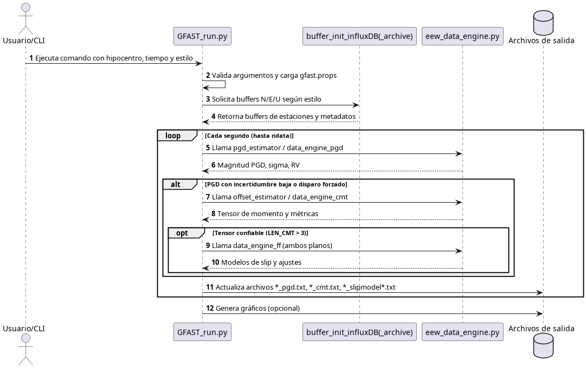

# Arquitectura del sistema GFAST-IG

## Resumen
El sistema **GFAST** automatiza el procesamiento rápido de datos GNSS para estimar la magnitud, el tensor de momento y la ruptura en falla finita de un evento sísmico. La ejecución se dispara desde la línea de comandos aportando el hipocentro y la hora de origen; el flujo lee posiciones desde InfluxDB, calcula observables y escribe productos de salida en `output/`.

## Componentes principales

| Componente | Rol | Detalles relevantes |
|------------|-----|---------------------|
| `GFAST_run.py` | Orquestador | Valida parámetros CLI, obtiene credenciales (`gfast.props`), construye buffers de datos, controla el bucle temporal y decide cuándo ejecutar cada estimador. 【F:GFAST_run.py |
| `buffer_init_influxDB.py` / `buffer_init_influxDB_archive.py` | Ingesta | Consultan InfluxDB en tiempo real o desde archivos históricos para construir los buffers Norte, Este, Vertical y los vectores de tiempo.  |
| `eew_data_engine.py` | Núcleo numérico | Implementa estimadores de desplazamiento máximo (PGD), componentes del tensor de momento y la inversión de falla finita a partir de los buffers. |
| `scaling.py`, `cmt.py`, `fault_plane.py`, `RTOkada.py` | Algoritmos específicos | Albergan las relaciones empíricas PGD, cálculo de tensores de momento, proyección de planos de falla y el solver Okada en tiempo real. Se invocan desde `eew_data_engine.py`.  |
| `plotting.py` | Visualización | Recibe resultados para graficar magnitudes, tensores y modelos de ruptura (invocado desde `GFAST_run.py`). |
| Archivos estáticos (`M99.txt`, `Ecuador2016_disp_pgd_v2.chan`) | Parámetros | Contienen curvas de incertidumbre PGD y listas de canales para reproducción offline.  |

## Flujo de ejecución
1. **Entrada CLI**. `GFAST_run.py` recibe `[lat lon dep timestamp eqname ndata style (chanfile)]` y abre/crea el directorio `output/`. 
2. **Configuración**. Carga credenciales InfluxDB mediante `paraminit.Properties` (`gfast.props`) y fija parámetros globales (tasa de muestreo, rutas de salida, dimensiones de la malla de falla). 

3. **Construcción de buffers**. Dependiendo de `style`, usa `buffer_init_influxDB` (tiempo real) o `buffer_init_influxDB_archive` (reprocesamiento) para obtener buffers N/E/U y metadatos de estaciones. 
4. **Bucle temporal**. Itera cada segundo hasta `ndata`, aplicando:
   - `pgd_estimator` → `data_engine_pgd` para calcular magnitud PGD, sigma y reducción de varianza. 

   - Si la incertidumbre PGD < 0.5 o ya se disparó una vez, ejecuta `offset_estimator` y `data_engine_cmt` para estimar el tensor de momento. 
   - Una vez disponible un tensor confiable (`LEN_CMT > 3`), invoca `data_engine_ff` para la inversión de falla finita con ambos planos nodales. 【F:GFAST_run.py†L209-L282】
5. **Persistencia**. Los resultados se escriben continuamente en archivos `gfast_<evento>_*.txt` para PGD, CMT, slip-model y ajustes vectoriales. 

## Entradas y salidas

### Entradas
- **Línea de comandos**: ubicación hipocentral, tiempo de origen UTC, nombre del evento, ventana (`ndata`), estilo de ejecución y, opcionalmente, archivo de canales.

- **Credenciales**: `gfast.props` debe contener host, puerto, usuario, contraseña y base de datos para InfluxDB.

- **Datos GNSS**: buffers N/E/U por estación, obtenidos desde InfluxDB o archivos archivados.

### Salidas
- **Archivos ASCII** en `output/`: magnitudes PGD (`_pgd.txt`), valores individuales (`_pgd_values.txt`), soluciones CMT (`_cmt.txt`), resúmenes de falla (`_slipmodel_overview.txt`), modelos de slip (`_slipmodel.txt`) y ajustes de vectores (`_slipfits.txt`). 

- **Gráficos** (opcional): `plotting.py` puede generar figuras si se activa en el flujo (no habilitado por defecto).

## Dependencias externas
- **Python científico**: `numpy`, `math`, `obspy`, `matplotlib`, `geopy` para cálculos geodésicos y gráficos. 

- **Base de datos**: servidor InfluxDB accesible mediante las credenciales proporcionadas.
- **Archivos estáticos**: la tabla `M99.txt` para incertidumbre PGD y archivos de canales para reproducción.

## Supuestos y parámetros clave
- Corrección de tiempo fijo de −5 horas para datos en tiempo real (`style=0`).
- Paso temporal fijo (`datarate = 1 s`) y rejilla de falla `nstr=10`, `ndip=5`.
- Se requieren al menos 4 estaciones (`len(a1) > 3`) para disparar cálculos PGD, CMT y falla finita.

## Extensibilidad
- Nuevos estimadores pueden añadirse en `eew_data_engine.py` aprovechando los buffers calculados.
- Las constantes operativas (offset horario, tamaños de rejilla, umbrales) deberían externalizarse en archivos de configuración para facilitar despliegues en otras redes.
- Migrar la interfaz CLI a `argparse` permitiría generar ayuda integrada y pruebas automatizadas sobre funciones puras.

## Diagrama de secuencia del flujo principal
El diagrama de secuencia se mantiene en [`docs/diagrams/gfast_sequence.puml`](diagrams/gfast_sequence.puml). Exporta el flujo completo desde la invocación de la CLI hasta la escritura de resultados, y puede renderizarse con cualquier visor PlantUML externo.

## Mapa de módulos y dependencias
El mapa de módulos está disponible en [`docs/diagrams/gfast_modules.puml`](diagrams/gfast_modules.puml). Resume las dependencias entre el orquestador, los inicializadores de buffers y los algoritmos numéricos especializados.

